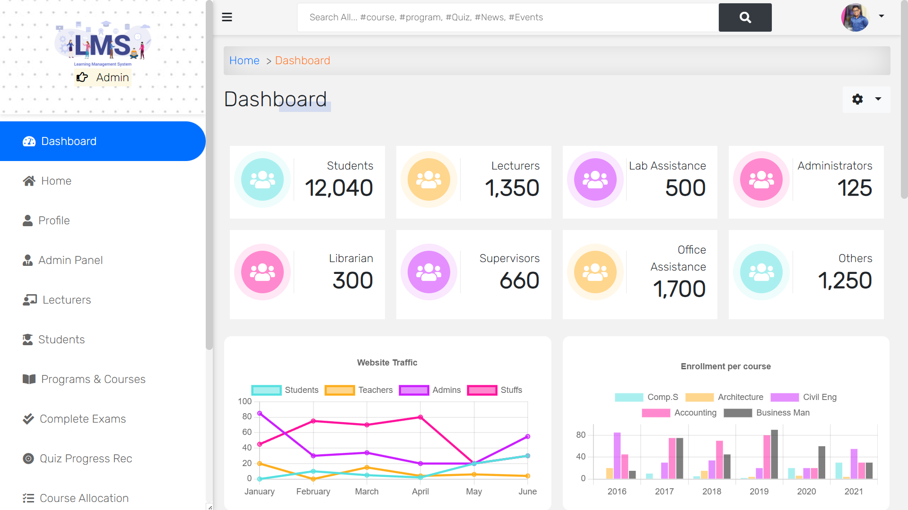

# Learning management system using django web framework




Current features
----------------

* News And Events
* The admin can Add Students
* The admin can Add Lecturers
* Students can Add and Drop courses
* Lecturers submit students score (Attendance, Mid exam, Final exam, assignment)
* The system calculat students Total, Avarage, point, and grade automaticaly
* Also, the system tells the student whether he/she pass, fail or pass with a warning
* Assessment result
* Grade result
* Upload video and documentations for each course
* PDF generator for students registration slip and grade result
* Storing of quiz results under each user
* Question order randomisation
* Previous quiz scores can be viewed on category page
* Correct answers can be shown after each question or all at once at the end
* Logged in users can return to an incomplete quiz to finish it and non-logged in users can complete a quiz if their session persists
* The quiz can be limited to one attempt per user
* Questions can be given a category
* Success rate for each category can be monitored on a progress page
* Explanation for each question result can be given
* Pass marks can be set
* Multiple choice question type
* True/False question type
* Essay question type
* Custom message displayed for those that pass or fail a quiz
* Custom permission (view_sittings) added, allowing users with that permission to view quiz results from users
* A marking page which lists completed quizzes, can be filtered by quiz or user, and is used to mark essay questions

# Pre-requisites:

> The following programs are required to run the project

- [Any Python-3 version](https://www.python.org/downloads/)
- [PostgreSQL database](https://www.postgresql.org/download/)

# Installation

- Clone the repo with `git clone https://github.com/adilmohak/django-lms.git`
- Create and activate a python virtual environment
- `pip install -r requirements.txt`
- Create `.env` file inside the root directory and include the following variables

```config
DB_NAME=[YOUR_DB_NAME]
DB_USER=[DB_ADMIN_NAME]
DB_PASSWORD=[DB_PASSWORD]
DB_HOST=localhost
DB_PORT=
USER_EMAIL=[YOUR_EMAIL]
USER_PASSWORD=[EMAIL_PASSWORD]
STRIPE_SECRET_KEY=LEAVE_THIS_BLANK_FOR_NOW
STRIPE_PUBLISHABLE_KEY=LEAVE_THIS_BLANK_FOR_NOW
```

- `python manage.py makemigrations`
- `python manage.py migrate`
- `python manage.py runserver`

Last but not least, go to this address http://127.0.0.1:8000

### References

- Quiz part: https://github.com/tomwalker/django_quiz

# Connect with me

<div>
<a href="https://www.linkedin.com/in/anandjaiswar02" target="_blank">

</a>
<a href="https://github.com/anand-3399" target="_blank">

</a>
<a href="https://www.facebook.com/anand360" target="_blank">

</a>
</div>

### Show your support by ⭐️ this project!
